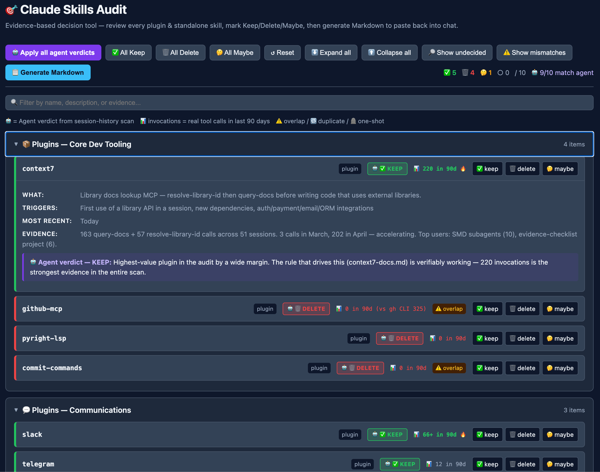
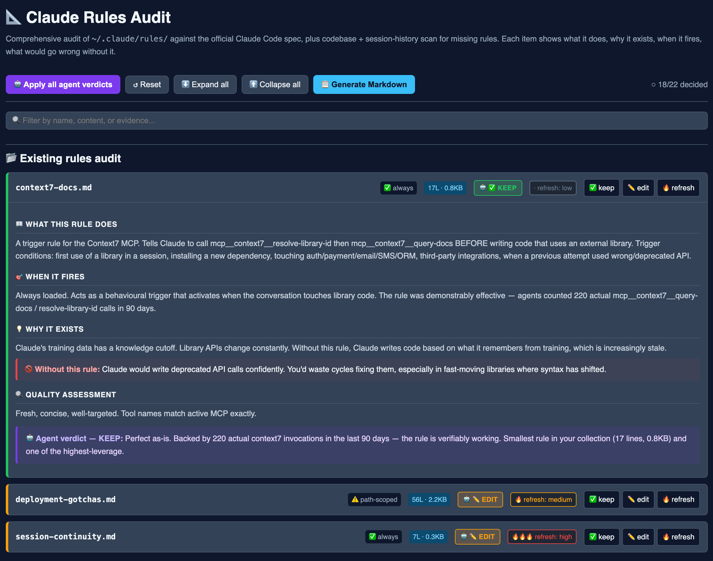

# claude-config-audit

> **Evidence-based audit + cleanup for Claude Code installations.** Decide what to keep, delete, or refresh across plugins, skills, rules, hooks, and MCP servers — grounded in your actual session history, not generic recommendations.

[](https://opensource.org/licenses/MIT)
[](https://docs.claude.com/en/docs/claude-code)
[]()
[](https://github.com/MJWNA/claude-config-audit/actions/workflows/ci.yml)

A Claude Code skill + plugin that scans your installation, dispatches parallel sub-agents to evaluate usage from your own session history, generates two interactive HTML decision tools, and safely executes the cleanup you choose — with quarantine-based reversibility and decision memory across runs.



---

## 🎯 Why this exists

Your Claude Code installation is probably bloated. It happens to everyone:

You install a plugin to try a feature. It works for that one task, then sits there forever. You add a custom skill in a moment of inspiration — never invoke it again. You write a user-scope rule from a single correction, and three months later it's still loading on every session even though the situation never recurred. **Nothing ever gets removed.**

A few months later you've got dozens of plugins and skills and rules, and you can't remember which ones actually pull weight. The slash command list takes a second to scroll. Your context window starts every session preloaded with skill descriptions you'll never trigger. You feel vaguely guilty about it but the prospect of making 50 keep/delete decisions is paralysing.

**This skill fixes that — properly, with evidence, and reversibly.**

It looks at your actual session history (the `.jsonl` files Claude Code writes for every session) and counts which plugins, skills, hooks, and rules you've actually invoked in the last 90 days. Then it presents the findings in a clean interactive UI so you can sweep through items in 30 minutes instead of 3 hours. Deletions go to a quarantine for 7 days — `mv`'d items reverse with a single command; rule edits use copy-snapshots that surface a conflict prompt on restore so you can decide which version to keep.

After: your install is leaner. Sessions start faster. Your slash command list is the things you actually use. Your `~/.claude/rules/` is the rules that genuinely prevent mistakes, not the ones you forgot you wrote.

---

## ✨ What you get

When you run this skill, by the end of the session you have:

| Outcome | Detail |
|---|---|
| 📊 **Evidence reports** | Per-item invocation counts, recency, overlap analysis, security findings, agent verdicts with confidence ratings |
| 🎨 **Interactive HTML decision tools** | Saved to your workspace with your actual config pre-loaded — review, decide, export |
| 📝 **Self-contained markdown summary** | Every decision plus full proposed content for new rules — paste back to chat, no scrollback dependency |
| 🧹 **A cleaner installation** | Items you don't use moved to quarantine, rules updated, CLAUDE.md restructured |
| 💾 **Reversible quarantine** | Every "deletion" is a `mv` to a timestamped session (one-line restore for these); rule edits get a copy-snapshot in the same session so you can roll back via a guided conflict prompt. 7-day TTL. |
| 📚 **Decision memory** | Next audit shows only deltas — items new since last time, items where evidence changed, snoozed items now due |
| 🔐 **Security pass** | Dedicated agent flags hooks calling network commands, hardcoded tokens, suspicious MCP endpoints, over-broad allowed-tools |
| 🔄 **Restart prompt** | With smoke-test ideas for new rules and quarantine-restore instructions if anything's wrong |

---

## 🚀 Quickstart

### 1. Install

**As a plugin (recommended — gets you `/audit-skills` and `/audit-rules` slash commands plus plain-language triggering):**

Add the repository as a Claude Code marketplace, then install:

```text
/plugin marketplace add MJWNA/claude-config-audit
/plugin install claude-config-audit@MJWNA
```

Or from the CLI:

```bash
claude plugin marketplace add MJWNA/claude-config-audit
claude plugin install claude-config-audit@MJWNA
```

To test a local checkout without registering it as a permanent install:

```bash
claude --plugin-dir /path/to/claude-config-audit
```

The plugin layout follows the official spec — `skills/claude-config-audit/SKILL.md` is where Claude Code expects a plugin-bundled skill to live. In this repo the plugin-side `skills/claude-config-audit/` directory contains symlinks pointing at the canonical files at the repo root, so plugin discovery finds the skill while the standalone-skill install also works. Both paths resolve scripts via `${CLAUDE_PLUGIN_ROOT}` (set automatically by Claude Code) with a fallback to `~/.claude/skills/claude-config-audit/`.

**As a standalone skill** (no slash commands, plain-language triggering only):

```bash
git clone https://github.com/MJWNA/claude-config-audit.git ~/.claude/skills/claude-config-audit
```

Standalone install reads SKILL.md at the clone root directly. Use this path if you don't want the slash commands or if your Claude Code version doesn't support plugins.

### 2. Restart Claude Code

The skill becomes available after restart. Claude Code reads `~/.claude/skills/` and the plugin manifest at session start.

### 3. Trigger it

Three ways:

```
/audit-skills    # plugins + standalone skills, hooks, MCPs
/audit-rules     # user-scope rules + CLAUDE.md
```

Or in plain language:

> Audit my Claude config

> Clean up my skills

> Spring clean Claude

> Which plugins should I delete

> My ~/.claude is bloated

The description covers the common phrasings. See [`evals/evals.json`](evals/evals.json) for the full set tested against the description.

### 4. Walk through

Claude will:

1. Run a prerequisite check + inventory your install (user-scope, plus project-scope if you ask)
2. Read decision history if a previous audit exists — surface only deltas
3. Dispatch parallel sub-agents, including a dedicated security-pass agent
4. Generate the HTML decision tools (saved to your current directory)
5. Tell you to open them: `open ./skills-audit.html`
6. Wait for your decisions (you click through cards in the browser)
7. Receive your markdown export when you paste it back to chat
8. Show you the exact quarantine commands and ask for "go"
9. Execute the cleanup with quarantine + history save
10. Prompt you to restart Claude Code

Total time: ~30-60 minutes for a first-time audit. Subsequent audits using decision memory are ~10-15 minutes.

---

## 🧭 What the skill audits

It splits your installation into two halves, each runnable independently:

### Half 1 — Skills audit (`/audit-skills`)

Targets the **executable layer**:

- **Plugins** in `~/.claude/plugins/installed_plugins.json`
- **Standalone skills** under `~/.claude/skills/`
- **Hooks** defined in `~/.claude/settings.json` and `settings.local.json`
- **MCP servers** registered in user settings

For each item the skill answers: *did the user actually invoke this in the last 90 days?* Plus the security-pass agent checks: *is anything here unsafe?* (hooks calling `curl` in `PreToolUse`, hardcoded tokens, over-broad permissions).

Cleanup quarantines items rather than deleting them. For `mv`'d items (deleted plugins/skills) restoration is one command. For copy-snapshots (rule edits) the script surfaces a CONFLICT prompt — the original is still in place, possibly edited, and the script asks you whether to keep the edit or roll back to the snapshot. Both flows are reversible for 7 days.

### Half 2 — Rules audit (`/audit-rules`)

Targets the **instruction layer**:

- **User-scope rules** under `~/.claude/rules/`
- **The CLAUDE.md rule index** (the table that documents which rules load when)
- **Project-scope rules** if you pass `--project` (read-only — flagged for promotion or contradiction, never modified)

Rules don't get "invoked" the way skills do — they load passively into context. So this half asks different questions:

- Is the content fresh, or does it reference deleted skills/projects?
- Is the frontmatter correct (per the official Claude Code spec)?
- Does the CLAUDE.md index match actual loading behaviour?
- Are there cross-project patterns that should be promoted to user-scope?
- Are there session-history patterns (corrections you keep giving Claude) that should be encoded as rules?

Outcome: writes new rule files, edits existing ones, restructures the CLAUDE.md rule index. Every edit is preceded by a quarantine snapshot.

**You can run either half on its own** — `/audit-skills` and `/audit-rules` are separate slash commands — but most users benefit from both.

---

## 🤝 Neighbour-skill awareness

Many users have other skills installed that overlap with parts of this audit's surface — CLAUDE.md improvers, hook generators, permission optimisers, security scanners. The audit doesn't compete with them. Instead, at runtime it reads what you actually have installed (not a hardcoded list) and offers to hand off the relevant slice to whichever neighbour skill is best suited.

You'll see something like: *"You've got `<skill-name>` installed — it's a better fit for this specific finding. Hand off?"* Then it's your call. The skill never assumes specific neighbour skills exist; it discovers them from your config.

---

## 🎬 What it looks like

When you trigger the skill, here's what the conversation looks like (abbreviated):

> **You:** "Audit my Claude config"
>
> **Claude:** Running prerequisite check… ✅ Found N plugins, M standalone skills, K user-scope rules, X session files. Last audit was 31 days ago — 4 items have new evidence since. Want both halves or just one?
>
> **You:** "Both"
>
> **Claude:** Starting skills audit. Dispatching 5 parallel agents (4 buckets + 1 security pass)…
>
> *(60-180 seconds — agents work in parallel)*
>
> **Claude:** All agents back. Built `./skills-audit.html` with your actual config pre-loaded. **Open it: `open ./skills-audit.html`**. Click "Apply all agent verdicts" to bulk-load recommendations, walk through each card, then paste the generated markdown back here.

### Skills audit decision tool

Each plugin or standalone skill becomes a card with the agent's verdict, the actual invocation count from your session history, the evidence behind the verdict, the agent's confidence rating, and a three-way decision toggle:


The sticky toolbar shows live counts (`✅ 5 · 🗑️ 4 · 🤔 1 · ○ 0 / 10 · 🤖 9/10 match agent`) so you always know how much is left and where you've overridden the agent.

### Rules audit decision tool

The rules half has a richer interface — five sections (existing rules, classification mismatches, new rule candidates, extensions, spec primer) and additional decision options per section. Each existing rule shows what it does, when it fires, why it exists, what would go wrong without it, plus a refresh-value rating with explanation:



For new rule candidates, the card includes the **full proposed file content** in an expandable section — so you can see exactly what would land in `~/.claude/rules/<name>.md` before saying yes. The markdown export embeds this content so the workflow doesn't depend on Claude remembering scrollback.

### Output

You make decisions, hit **📋 Generate Markdown**, paste back. Claude shows the quarantine plan, you say "go", it executes. Your decisions are saved to `~/.claude/.audit-history/` for next time. Done.

The full sample output is in [`examples/sample-audit-output.md`](examples/sample-audit-output.md).

---

## 🏗️ How it works (technical breakdown)

For readers who want to know exactly what's happening under the hood.

### Architecture

```
Trigger (/audit-skills, /audit-rules, or description match)
  ↓
SKILL.md loaded into Claude's context
  ↓
Phase 1: Prerequisite check (scripts/verify-prerequisites.sh)
  ↓
Phase 2: Discovery (scripts/discover-config.sh [--project])
  ↓
Phase 3: Deterministic invocation counts
         (scripts/analyze-session-history.py --window-days 90)
         walks ~/.claude/projects/**/*.jsonl, emits JSON the agents read
         instead of grepping themselves
  ↓
Phase 4: Decision memory check (scripts/audit-history.py latest/diff)
  ↓
Phase 5: Categorise items into 4-6 buckets per audit half
  ↓
Phase 6: Dispatch parallel sub-agents (4-5 buckets + 1 security pass)
  ↓                                    ↓
  Each bucket agent reads the           Each rules-half agent has
  pre-computed counts JSON and          a distinct purpose:
  interprets them — never               - Existing rules quality audit
  re-greps the JSONL, never             - Codebase pattern scan
  invents counts the JSON               - Official spec lookup
  doesn't contain.                      - Session-history archaeology
                                        - Security pass
  Plus: 1 dedicated security-pass agent
  scanning hooks, MCPs, settings
  ↓                                    ↓
Phase 7: Synthesise findings into JSON (sections + securityFindings,
         with confidence + reasonCodes per item)
  ↓
Phase 8: scripts/inject-audit-data.py splices the JSON into the HTML
         template — JSON-encoded, with </script>, <, U+2028, U+2029
         escaped so agent output cannot break the script tag
  ↓
[USER REVIEWS IN BROWSER — outside chat]
  ↓
Phase 9: User pastes self-contained markdown export
  ↓
Phase 10: Confirm quarantine plan, get "go"
  ↓
Phase 11: Execute via quarantine (mv, not rm -rf) + save history
  ↓
Phase 12: Verify + restart prompt + restore instructions
```

### Session-history evidence sources

`scripts/analyze-session-history.py` is the deterministic counter — agents interpret what it produces, they don't re-grep the JSONL or invent counts:

| Signal | Where it comes from |
|---|---|
| Formal `Skill` tool calls | `tool_use` blocks where `name == "Skill"` and `input.skill == "<name>"` |
| User-typed slash commands | `<command-name>/<name></command-name>` tags in user messages |
| Bash command patterns | `tool_use` Bash commands matching `--bash-pattern label=regex` (repeatable) |

For each signal the script emits `count`, `firstSeen`, `lastSeen`, and a `byDay` breakdown so agents can spot patterns (ramped through April, none since 04-10, etc.).

It explicitly does NOT count:

- Skill descriptions appearing in `<system-reminder>` skill registries (those appear in every recent session, regardless of usage)
- Mentions of the skill name in user prompts that don't actually trigger it
- Any string that isn't a structurally-matched tool call or command tag

This filtering is critical — without it, every item would look "frequently invoked" because skill registries appear in 99% of sessions. Earlier versions delegated counting to LLM agents; agents sample, summarize, and occasionally invent — moving counts to a deterministic Python pass means verdicts are grounded in real data.

### The HTML decision tools

Both templates are **self-contained single-file apps**:

- Vanilla JavaScript — no React, no framework, no build step
- Vanilla CSS — no preprocessor
- localStorage persistence — your decisions survive page reloads
- No external assets — works offline
- **Two layers of injection safety** — agent output is JSON-encoded with `<`, `</`, U+2028, and U+2029 escaped to `\\uXXXX` before the splice (`scripts/inject-audit-data.py`), then every interpolation is HTML-escaped at render time. Hand-editing the placeholder is not a supported path; agent output may legitimately contain `</script>` strings or line-separator characters that would break the script tag if injected raw.
- **🔐 Security findings section** rendered above the keep/delete cards when the security-pass agent flags anything. Findings are sorted high → medium → low, each with a three-state `fix-now / acknowledge / skip` toggle. Decisions are persisted to `localStorage` and prepended to the markdown export so you can paste back your fix/ack/skip choices alongside the keep/delete decisions.

The data shape (`confidence`, `reasonCodes`, `previousDecision`, plus `severity`, `category`, `evidence`, `why`, `fix` for security findings) is documented inline in each template's `SECURITY_DATA_SHAPE` and main item comment.

### Safety protocol

This is a destructive workflow — it modifies user-scope config that affects every Claude Code session. The safety rails:

| Rail | Implementation |
|---|---|
| Quarantine, not delete | Every `mv` goes to `~/.claude/.audit-quarantine/<timestamp>/`, 7-day TTL |
| Snapshot before edit | Files about to be edited are copied into the same quarantine session |
| Path verification | Always `ls` before any `mv`/`rm` |
| Manifest edit before cache move | Order matters — manifest first, cache second |
| Read before edit | Edit tool's anchor-string matching requires prior Read |
| Confirmation gate | Even in auto mode, quarantine commands shown before execution |
| Restart prompt | Plugin manifest read at session start; changes need restart |
| Decision history | Saved after execution so the next audit can surface only deltas |

Full detail: [`references/safety-protocol.md`](references/safety-protocol.md). What can and can't be undone: [`docs/SAFETY.md`](docs/SAFETY.md).

### Files modified

The skill operates strictly within `~/.claude/`:

| Path | Operation |
|---|---|
| `~/.claude/plugins/installed_plugins.json` | Atomic Python edit; copied to quarantine first |
| `~/.claude/plugins/cache/<marketplace>/<plugin>/` | `mv` to quarantine |
| `~/.claude/skills/<skill-name>/` | `mv` to quarantine for deleted skills |
| `~/.claude/rules/*.md` | `Write` (new files) and `Edit` (existing — snapshotted first) |
| `~/.claude/CLAUDE.md` | `Edit` for rule index updates — snapshotted first |
| `~/.claude/.audit-quarantine/` | Created and managed by the skill |
| `~/.claude/.audit-history/` | Append-only JSON of past audit decisions |

Nothing outside `~/.claude/` is touched. Project-scope `.claude/` directories are read for cross-project pattern detection but never modified. Settings files (`settings.json`, `settings.local.json`) are read by the security-pass agent for analysis but never edited automatically.

### Repository layout

```
claude-config-audit/
├── SKILL.md                            # Main skill — frontmatter + workflow guide
├── README.md                           # This file
├── LICENSE                             # MIT
├── CHANGELOG.md
├── SECURITY.md                         # Vulnerability reporting policy
├── .gitignore
├── .claude-plugin/
│   └── plugin.json                     # Plugin manifest (for plugin install path)
├── .github/
│   ├── ISSUE_TEMPLATE/                 # Bug report + feature request templates
│   └── workflows/
│       └── ci.yml                      # bash -n + shellcheck + py_compile + tests + integration smoke
├── commands/
│   ├── audit-skills.md                 # /audit-skills slash command
│   └── audit-rules.md                  # /audit-rules slash command
├── skills/
│   └── claude-config-audit/            # Plugin-canonical skill layout (symlinks to root)
│       ├── SKILL.md → ../../SKILL.md
│       ├── references → ../../references
│       ├── scripts → ../../scripts
│       └── assets → ../../assets
├── assets/
│   ├── skills-audit-template.html      # Self-contained HTML for skills decisions
│   └── rules-audit-template.html       # Self-contained HTML for rules decisions
├── references/
│   ├── skills-audit-workflow.md        # Phase-by-phase playbook for the skills half
│   ├── rules-audit-workflow.md         # Phase-by-phase playbook for the rules half
│   ├── parallel-agent-patterns.md      # Prompt templates including security-pass agent
│   ├── claude-config-spec.md           # Official Claude Code rule spec + bug citations
│   └── safety-protocol.md              # Backup/quarantine/rollback procedures
├── scripts/
│   ├── verify-prerequisites.sh         # Sanity check before audit
│   ├── discover-config.sh              # Inventory current install (portable bash)
│   ├── analyze-session-history.py      # Deterministic invocation counter (JSON output)
│   ├── inject-audit-data.py            # Safe HTML data splicer (JSON-encoded, escaped)
│   ├── quarantine.sh                   # Quarantine session management
│   ├── restore.sh                      # Restore from quarantine
│   └── audit-history.py                # Decision memory across runs
├── tests/
│   ├── test_analyze_session_history.py # Synthetic-projects fixture tests
│   ├── test_audit_history.py           # Envelope parsing + diff tests
│   ├── test_inject_audit_data.py       # Adversarial-payload injection tests
│   ├── test_quarantine_roundtrip.sh    # quarantine.sh + restore.sh roundtrip
│   └── test_integration.sh             # Full pipeline against synthetic ~/.claude/
├── docs/
│   ├── PHILOSOPHY.md                   # Why this skill exists
│   ├── HOW-IT-WORKS.md                 # Detailed phase-by-phase walkthrough
│   ├── SAFETY.md                       # What's modified, what's not, recovery
│   └── EXTENDING.md                    # Customisation guide
├── evals/
│   ├── evals.json                      # 10 should-trigger + 10 should-not-trigger
│   └── README.md
└── examples/
    └── sample-audit-output.md          # Illustrative audit output (placeholders, not specific)
```

The `references/` files use Claude Code's progressive disclosure pattern — they're not loaded into context until Claude reaches the corresponding phase. This keeps `SKILL.md` itself manageable while still giving Claude detailed playbooks when needed.

---

## ❓ FAQ

### How is this different from running `/plugin` and uninstalling things one at a time?

`/plugin` is the right tool for installing and managing individual plugins. This skill is for the audit moment — when you're staring at 50 items and asking "which 18 of these should go?" Different problem, different tool.

The audit is also evidence-based: you don't just delete things you "feel like you don't use" — you delete things you provably haven't invoked.

### Will this delete my session history?

No. The skill **reads** session history from `~/.claude/projects/` to count invocations, but never modifies it. Your sessions are safe.

### What if I'm on Claude.ai (web), not Claude Code (CLI)?

This skill needs Claude Code's parallel sub-agent dispatch and Bash access — neither is available on Claude.ai. The skill won't run there.

### What if my session history has been pruned?

The agents need session signal to give meaningful verdicts. If your `~/.claude/projects/` has fewer than ~50 sessions, the prerequisite check warns you that evidence will be thin and verdicts may be biased toward "looks underused." A fresh install with 10 sessions probably isn't worth auditing yet.

### How does decision memory work?

After every audit, your decisions (with reasons for any agent overrides) are saved to `~/.claude/.audit-history/<timestamp>--<half>.json`. The next audit reads the most recent file and surfaces only:

- **New items** — installed since last audit
- **Changed items** — where invocation evidence has shifted (e.g. a plugin you'd marked "Maybe / 0 calls" now has 5 calls)
- **Snoozed items now due** — anything you marked "ask me again in 30 days"

Stable items (kept since last audit, evidence unchanged) are rolled up under a collapsed section so you don't re-walk them. Subsequent audits become 10-15 min instead of 60.

### Can I customise the categories or HTML?

Yes. Both are template-driven. See [`docs/EXTENDING.md`](docs/EXTENDING.md). The HTML uses vanilla JS/CSS so changes are direct file edits — no build step.

### How long does this take?

| Stage | First audit | Subsequent audits |
|---|---|---|
| Prerequisite check + discovery | ~30 seconds | ~30 seconds |
| Parallel agent execution | ~60-180 seconds | ~30-60 seconds (deltas only) |
| User reviews HTML | ~20-30 minutes | ~5-10 minutes |
| Cleanup + history save | ~30 seconds | ~30 seconds |
| **Total per half** | **~30 minutes** | **~10 minutes** |

Most of the wall-clock time is you reviewing in the browser, which is exactly the work that requires your judgment.

### What if I don't trust the agent's verdicts?

The HTML shows you the evidence (invocation count, dates, concrete examples) and the agent's confidence rating before you decide. Override anything you disagree with. The skill captures your overrides in a "Where I overrode the agent" section of the markdown export — useful audit trail, and the override + reason is shown next to the item in the next audit.

### Will it work in a fresh Claude Code install?

Technically yes, but practically no — there's nothing to audit. Run it after you've been using Claude Code for a few months and have accumulated stuff.

### Does it support project-scope rules?

The rules-audit-half **reads** project-scope rules (`<project>/.claude/rules/`) when invoked with `--project` to identify cross-project patterns that should be promoted to user-scope, but does NOT modify them. Project-scope changes are owned by the project. The audit also flags user↔project rule contradictions when they exist.

### Can I run this on a CI server?

Not really — the workflow needs interactive HTML review. You can run the discovery and agent phases headlessly, but the decision phase requires a human in the loop. This is intentional: keep/delete decisions about your own config aren't a fit for autopilot.

### What's the absolute minimum useful run?

If you want a quick taste:

```
"Audit just my plugins, no agents, just list zero-invocation ones"
```

The skill will skip the parallel-agent phase and run discovery + show you a list of plugins/skills with no recent invocations. ~5 minutes, no review UI. Useful as a sanity check.

---

## 🛠️ Customising

Customisation guide: [`docs/EXTENDING.md`](docs/EXTENDING.md).

Quick pointers:

| Want to change | Edit |
|---|---|
| Agent prompts | `references/parallel-agent-patterns.md` |
| Categorisation buckets | `references/skills-audit-workflow.md` |
| What counts as an invocation | `scripts/analyze-session-history.py` (or pass `--bash-pattern label=regex` for plugin scripts) |
| HTML styling | `assets/*-audit-template.html` (CSS at top) |
| Markdown output format | `generateMarkdown()` in each HTML template |
| Security-finding categories the UI knows | `SECURITY_DATA_SHAPE` comment in each template + the security-pass prompt in `references/parallel-agent-patterns.md` |
| Time window (default 90d) | `--window-days` flag on `analyze-session-history.py`; references in `references/*.md` |
| Quarantine TTL (default 7d) | `CLAUDE_CONFIG_AUDIT_TTL_DAYS` env var |
| Prerequisite checks | `scripts/verify-prerequisites.sh` |

---

## 🗺️ Roadmap

Possible future enhancements (not promises):

- [ ] **Settings.json edit pass** — security-pass currently flags concerns; v3 might offer to fix the well-defined ones
- [ ] **Quarterly re-run reminder** — `/schedule` integration so you don't have to remember
- [ ] **Multi-machine sync** — diff your audit results across machines
- [ ] **Plugin marketplace insights** — flag plugins that have shipped major updates since you installed them
- [ ] **Lighter UI for small audits** — single-page form for installs with <15 items
- [ ] **Time-window selector** — let users pick 30d / 60d / 90d / 180d at runtime
- [ ] **WebSocket bridge** — replace paste-back with live decision streaming from the HTML to Claude
- [ ] **Scheduled quarantine purge** — auto-cleanup via system cron rather than manual `purge` command

PRs welcome.

---

## 🤝 Contributing

When proposing changes, include:

- A real audit output showing the change in action (paste the markdown export — placeholder names are fine)
- Updated documentation if the workflow changed
- Reproduction recipe if you fixed a bug
- New eval queries in `evals/evals.json` if your change affects triggering

The skill is intentionally opinionated about workflow but flexible about content. PRs that:

- Improve agent prompts → likely accepted
- Improve HTML interactions → likely accepted
- Add new safety rails → very likely accepted
- Add additional audit categories → likely accepted
- Restructure the dual-half workflow → discuss in an issue first

---

## 🙋 Common gotchas

- **`~/.claude/skills/` vs `~/.claude/plugins/installed/`** — older Claude Code versions used the latter. As of CC 1.x, standalone skills live at `~/.claude/skills/`. The skill verifies paths before operating, but you may see references to the older path in third-party docs.
- **Restart required after plugin changes** — the manifest is read at session start. Changes don't take effect until you fully quit and relaunch Claude Code.
- **Description field in rule frontmatter** — per the official spec, rules don't support `description:` (that's a skills-only field). It's silently ignored. The audit catches this and tells you, but doesn't fix it automatically (cosmetic).
- **CLAUDE.md "on demand" classification** — there's no "on demand" loading mode for rules. It's a mental model people often have, but it maps to "path-scoped" in the actual API. The audit reclassifies these.
- **Agent invocation count = real signal, not perfect signal** — the agents count formal Skill tool calls + slash commands + Bash patterns. Custom invocation paths (e.g. a plugin you trigger via a hook rather than a slash command) may show as "0 invocations" even when actively used. Override the agent if you have private context — your override + reason gets saved for the next audit.
- **Quarantine purge is manual** — until v2.x adds scheduled purge, you need to run `quarantine.sh purge` manually after the 7-day TTL elapses, or add it to your own cron.

---

## 📜 Credits

Original pattern by [Ronnie Meagher (@MJWNA)](https://github.com/MJWNA). v2 extends the skill with quarantine-based reversibility, decision memory, security-pass agent, slash commands, and project-scope coverage. v2.1 ships the security-findings UI, deterministic invocation counts (no more agent-invented numbers), HTML data-injection hardening (`</script>` / U+2028 / U+2029 escaped before splice), explicit `${CLAUDE_PLUGIN_ROOT}` resolution, and CI. v2.2 fixes the spec-canonical plugin layout (so plain-language triggering works under plugin install, not just standalone), quarantine session uniqueness, the rules-workflow snapshot ordering, the nested-fence markdown export bug, restore-semantics accuracy, the subshell-counter pattern, and adds an integration smoke test.

Detailed philosophy: [`docs/PHILOSOPHY.md`](docs/PHILOSOPHY.md).

Built with [Claude Code](https://docs.claude.com/en/docs/claude-code) — the skill audits the very tool that built it.

---

## 📜 License

[MIT](LICENSE) — use it, fork it, modify it, ship it. If you make improvements, PRs back to the main repo are appreciated but not required.

---

## 🔗 Related

- [Claude Code Skills documentation](https://docs.claude.com/en/docs/claude-code/skills)
- [Claude Code Memory + Rules documentation](https://docs.claude.com/en/docs/claude-code/memory)
- [skill-creator](https://github.com/anthropics/claude-plugins-official) — the official skill for creating skills (used to scaffold this one)

---

*Audit early, audit often. Or at least, audit once.*
